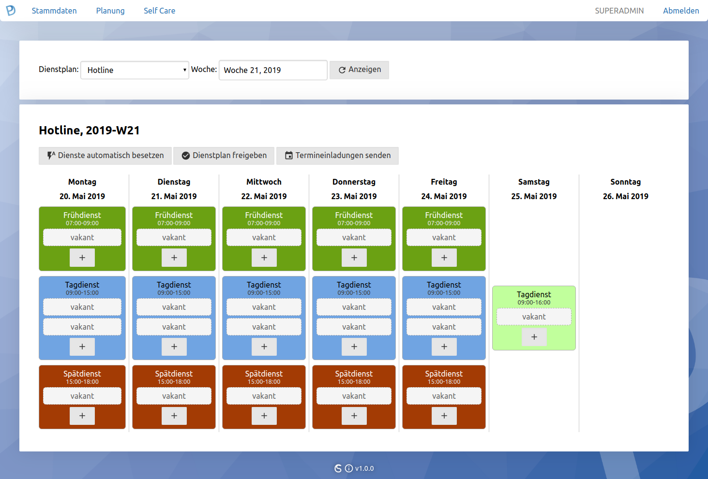

# 
*web based open source workforce management - webbasierte Open Source Dienstplansoftware*

## Highlights
- Die intuitive, browserbasierte Benutzeroberfläche erklärt sich von selbst und ist vollkommen plattformunabhängig.
- Der Dienstplanalgorithmus erstellt einen Wochenplan vollautomatisch auf Basis der Wochen- und Monatsarbeitszeit sowie der festgelegten Beschränkungen eines Mitarbeiters. Sie können feingranular einstellen, welche Dienste ein Mitarbeiter an bestimmten Wochentagen nicht ausführen kann.
- Mit dem optional aktivierbarem Self-Care-Portal können Mitarbeiter eigenständig ihre Dienste einsehen, tauschen, vakante Dienste besetzen und Abwesenheiten eintragen.
- Exportfunktion - Ausgabe im PDF- und HTML-Format zum Ausdrucken oder Einbetten in Kollaborations-Systeme oder Webseiten.
- LDAP-Anbindung für Benutzerimport möglich - binden Sie MASTERPLAN z.B. an Ihre Active-Directory-Domäne an und Mitarbeiter können sich mit dem selben Kennwort anmelden.
- Versenden von Termineinladungen für geplante Dienste sind via E-Mail möglich (zum Eintragen in Thunderbird- oder Outlook-Kalender).
- Rechtemanagement - Sie können für jeden Dienstplan separate Admins bestimmen, die die Pläne verwalten und Dienste besetzen dürfen.
- Integration in Ihr Corporate Design (CD) möglich.
- Programm-Anpassungen an Ihre Bedürfnisse auf Angebotsbasis möglich - wenn Sie eine Funktion vermissen nehmen Sie einfach Kontakt auf.

## Installation, Konfiguration & Verwendung
Bitte lesen Sie hierzu das PDF-Handbuch im Ordner "frontend/manual".

## Support & Cloud-Hosting
Sie haben keinen eigenen Webserver oder benötigen Unterstützung bei Installation oder Betrieb? Kein Problem. Nutzen Sie einen bereitgestellten Zugang für eine monatliche Gebühr pro Mitarbeiter oder nehmen Sie den E-Mail-Support in Anspruch. Bitte [kontaktieren Sie mich](https://georg-sieber.de/?page=impressum).

## Screenshots
  
  
  
  
  
  
  
  
  
