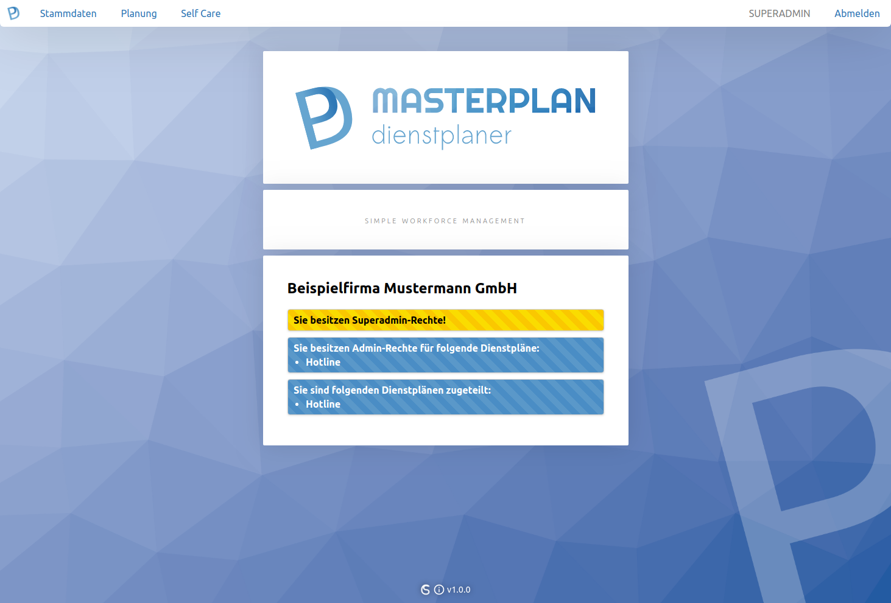

# MASTERPLAN
web based open source workforce management - webbasierte Open Source Dienstplansoftware

## Installation, Konfiguration & Verwendung
Bitte lesen Sie hierzu das PDF-Handbuch im Ordner "frontend/manual".

## Screenshots
  
  
  
  
  
  
  
  
  
  
